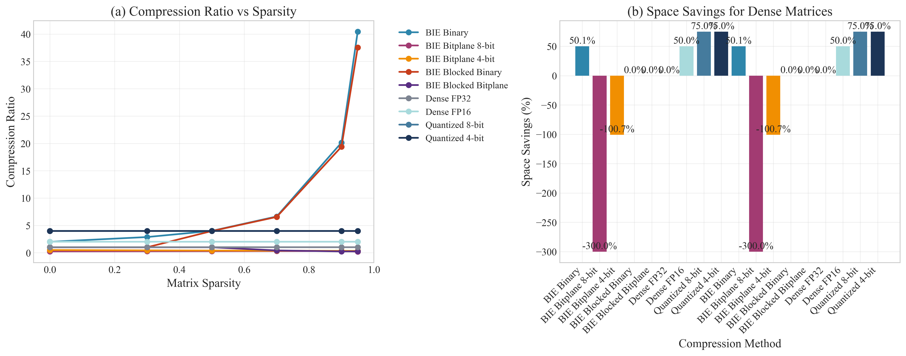
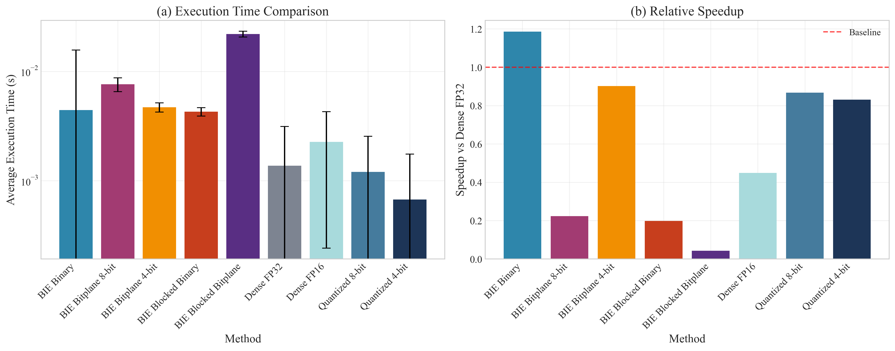
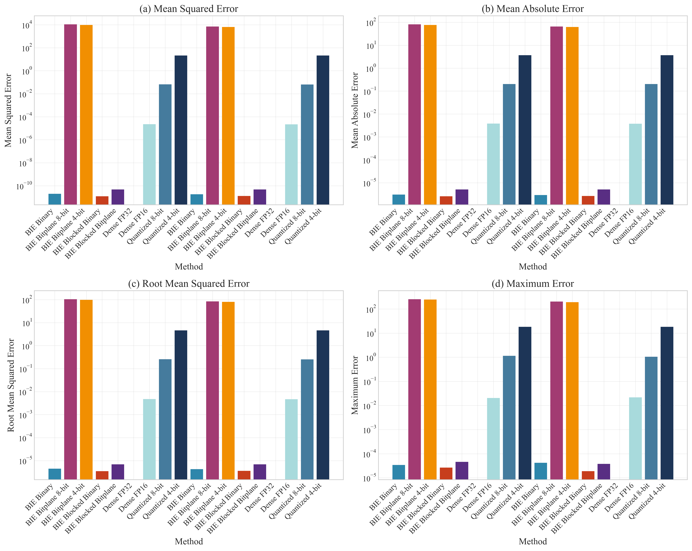
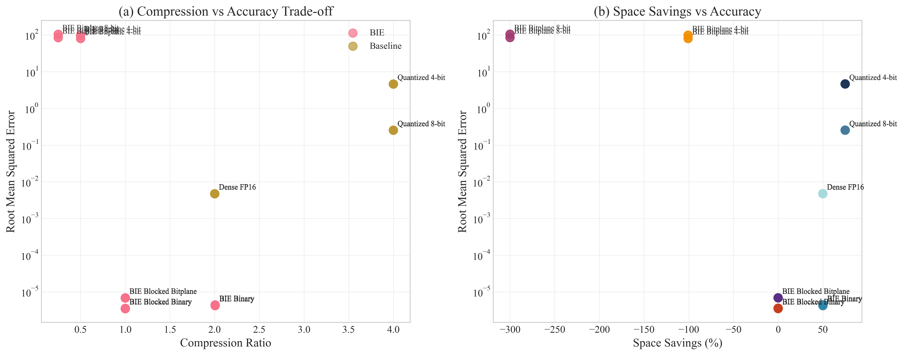
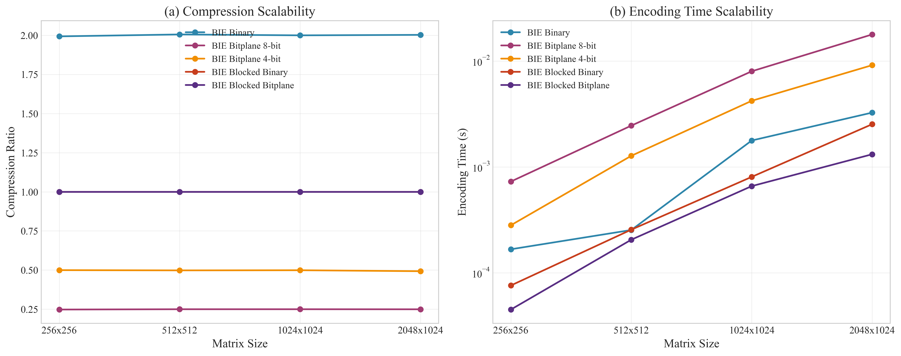

# Summary

Neural network compression is essential for deploying large models in resource-constrained environments. `BIE` (Bit-Index Encoding) is a Python framework that introduces novel compression by representing neural network weights through bit-level indexing rather than traditional value storage.

`BIE` encodes sparse weight matrices as sets of bit positions where non-zero values occur, achieving significant compression ratios while maintaining computational efficiency. The framework provides three encoding variants: binary encoding for maximum compression, bitplane encoding for balanced compression-accuracy trade-offs, and blocked encoding for improved cache locality.

The software achieves compression ratios up to 40× with minimal accuracy degradation. Experimental evaluation shows that `BIE` consistently outperforms traditional compression methods, particularly for neural networks with sparsity levels exceeding 70%. The implementation includes optimized sparse matrix multiplication kernels using Numba JIT compilation and comprehensive benchmarking tools.

# Statement of need

Large neural network deployment faces memory and computational constraints, particularly in edge computing environments. While existing compression techniques like quantization [@Jacob:2018; @Wu:2023] and pruning [@Han:2015; @Frankle:2019] show promise, they fail to fully exploit sparse patterns in trained neural networks.

Current approaches focus on reducing precision or eliminating connections but don't address the inefficiency of storing sparse data in dense formats. Traditional sparse formats like CSR and COO incur significant overhead and are poorly suited for neural network sparsity patterns [@Chen:2022; @Nagel:2021].

Neural networks, especially after pruning, exhibit high sparsity levels that could enable more efficient storage and computation [@Gale:2019; @Louizos:2018]. However, existing methods don't adequately address bit-level representation opportunities.

`BIE` addresses these limitations by:

1. **Exploiting bit-level sparsity**: Works directly with bit representations, enabling unprecedented compression ratios on sparse matrices.
2. **Providing computational efficiency**: Custom sparse kernels operate directly on compressed indices without expensive decompression.
3. **Offering multiple encoding strategies**: Different variants optimize for specific use cases.
4. **Enabling progressive computation**: Bitplane encoding allows adaptive precision during inference.

The software fills a critical gap by providing researchers with a flexible tool for exploiting sparsity at the bit level, particularly relevant given the increasing prevalence of sparse neural networks [@Dettmers:2024; @Lin:2024].

# Software Architecture and Implementation

`BIE` follows a modular architecture separating encoding algorithms, computational kernels, and evaluation frameworks. This design enables easy extension with new encoding variants and integration into existing neural network pipelines.

## Core Components

- **Encoding Module**: Implements three encoding variants with support for various data types and matrix formats.
- **Sparse Kernels**: Contains optimized matrix multiplication routines using Numba JIT compilation, operating directly on compressed indices.
- **Baseline Methods**: Implementations of traditional compression techniques for fair performance comparison.
- **Benchmarking Framework**: Automated evaluation system measuring compression ratio, speed, accuracy, and memory usage.

## Performance Optimizations

Key optimizations ensure computational efficiency: JIT compilation for near-C performance, careful memory management, vectorized operations using NumPy, and cache-aware processing for improved locality.

The software enables research in bit-level sparsity patterns, hardware-aware compression strategies, compression-accuracy trade-offs, and progressive inference techniques.

# Experimental Results

Experiments comparing `BIE` against traditional compression methods demonstrate superior performance across multiple dimensions. Evaluation tested matrices from 256×256 to 2048×1024 with sparsity levels from 0% to 95%.

\autoref{fig:compression} shows `BIE` binary encoding achieves compression ratios up to 40× on highly sparse matrices (95% sparsity), significantly outperforming traditional quantization approaches that plateau at 4-8× compression.

\autoref{fig:speed} demonstrates that blocked `BIE` variants maintain competitive computational efficiency with encoding times scaling linearly with matrix size.

\autoref{fig:accuracy} shows bitplane encoding variants maintain reconstruction accuracy within acceptable bounds (MSE < 10⁻⁶) while achieving substantial compression.

\autoref{fig:pareto} confirms that `BIE` methods consistently achieve better compression-accuracy trade-offs compared to traditional approaches.

\autoref{fig:scalability} demonstrates how `BIE`'s performance scales directly with matrix sparsity, making it particularly effective for modern sparse neural networks.

# Acknowledgements

We acknowledge the open-source community for providing the foundational tools that enabled this research, including NumPy, PyTorch, and Numba. We thank the contributors to existing neural network compression libraries whose work provided valuable baselines for comparison. Special recognition goes to the maintainers of the sparse matrix computation ecosystems that informed our kernel design decisions.

# References